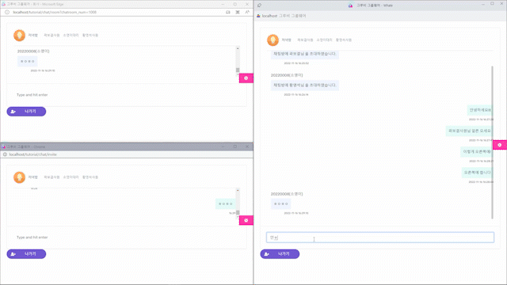

# 그룹웨어 서비스 Groubee

### 프로젝트 소개
효율적인 업무 관리와 협업을 위한 그룹웨어 서비스를 기획.  
전자결재, 근태관리, 웹메일 등 다양한 서비스를 제공

**팀원**

총 6명

**개발기간**

2022.09.28 ~ 2022.10.27 (1개월)

---

### 내가 맡은 역할
- 서비스 기획 및 ERD 설계 (공동)
- AWS RDS 구축 및 Oracle 데이터베이스 연동
- 커뮤니티 파트를 전담하여 백엔드와 프론트엔드 개발

 

### 내가 사용한 기술

**언어**: `Java`

**프레임워크**: `Spring Legacy`, `MyBatis`

**프론트**: `JSP`, `jQuery Ajax`

**데이터베이스**: `Oracle`, `Amazon RDS`

**형상관리**: `Git`

**기타**: `STOMP (WebSocket)`

 

# 구현 기능
실시간 채팅, 게시판, 프로필

 

## 실시간 채팅
1. **채팅방 생성 및 삭제**: 채팅방 이름을 입력하여 생성
2. **채팅방 목록**: 현재 로그인 중인 사람이 참여하고 있는 채팅방 목록
3. **사원 초대하기**: 전체 사원 목록에서 체크박스로 여러명 초대 가능
4. **이전 채팅 기록**: 채팅방을 나가거나 로그아웃을 해도 채팅 기록이 남음
5. **알림 기능**: 실시간 초대 알림과 채팅 알림, 알림 클릭 시 채팅방으로 이동

  

### 초대하고 싶은 사원 선택

- 사원 전체 목록에서 초대하고 싶은 사원을 선택하여 초대한다.
- 체크박스로 여러명 선택 가능하다.
 

### 선택한 사원 초대

- 초대 시 채팅방에 참여중인 사람 목록이 update 된다.
- 초대받은 사원은 왼쪽 메뉴의 하단에 알림이 뜬다.
- 알림을 누르면 해당 채팅방이 열린다.
 

### 채팅방 알림

- 내가 참여중인 채팅방에서 누군가 채팅을 하면, 채팅방에 참여 중인 사람들에게 알림이 간다.
- 알림은 일정 시간이 지나면 사라진다.
 

### 실시간 채팅

 

### 게시판
1. **댓글 작성 및 삭제 jQuery Ajax로 비동기처리**
2. 관리자 - 공지사항 작성: 중요도가 높은 공지사항은 자유게시판의 상단에 나타나도록 함
3. 관리자 - 게시판 삭제 혹은 영구삭제

### 프로필
좌측메뉴 상단의 프로필에 현재 로그인 중인 사람의 인적사항이 나타나도록 함

 

## 회고
팀 프로젝트에서 Git을 활용하면서 혼자서는 경험하기 어려운 Git을 통한 협업에 대해 경험할 수 있는 소중한 시간이었습니다.
 
팀 프로젝트는 성공적으로 마무리했지만 몇 가지 문제를 겪었습니다.
  
**설계의 중요성**: 여러번 회의를 거치며 프로젝트 초기 설계에 공을 들였지만 아쉽게도 DB를 수정하는 일이 생겼고 그로인해 개발 중간에 어려움을 겪었습니다. 기획 및 설계 단계에서 꼼꼼하게 계획을 짜야 개발 시간을 단축할 수 있다는 것을 경험으로 알게되었습니다. 
 
**의사소통 강화**: 프로젝트 초반, 변경사항이 전달되지 않아 갈등이 발생한 경험이 있는데 그로 인해 사소한 것이라도 팀원과 공유해야한다는 것을 깨달았고 이후 메신저와 구글시트를 활용하여 변경사항을 즉시 공유하고 기록하는 방식으로 팀 내 의사소통 방식을 강화하였습니다.
 
### 더 나아가
팀 프로젝트는 프론트엔드와 백엔드를 나누어 개발하지 않고, 각 기능별로 역할을 나누어 한 사람이 프론트엔드와 백엔드를 모두 개발하는 형태로 진행되었습니다.  
프론트엔드와 백엔드 모두 경험할 수 있는 기회였지만 동시에 프론트엔드 개발자와 백엔드 개발자의 명확한 구분이 있는 경우에 대한 경험이 부족하다는 단점이 있기 때문에 이러한 점을 보완하기 위해 프로젝트 종료 이후, API 명세서를 작성하는 방법, 변경사항에 대한 의사소통 방법 등 자료를 찾아보면서 실무에서는 어떤식으로 소통하는지 간접적으로나마 경험을 쌓고자 했습니다.
